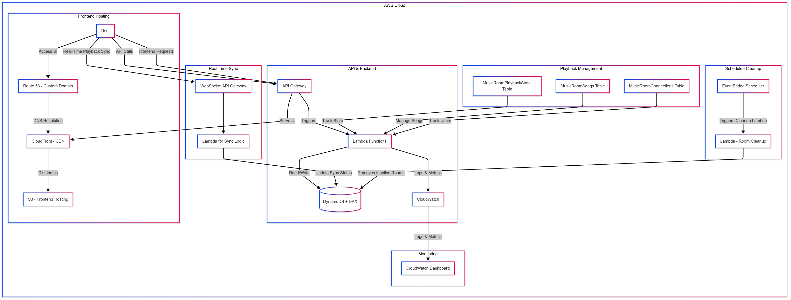

# Sync Room - Frontend
**Listen Together, Stay in Sync**  

Welcome to the frontend repository of **Sync Room**, a collaborative music listening platform that lets users create rooms, add songs, and enjoy perfectly synced playback with friends in real time.  

---

## 🌟 About Sync Room  

Sync Room is an innovative app built using **AWS Cloud Architecture** to provide a seamless and scalable experience for music lovers around the globe. Whether it's a party, study session, or a casual hangout, Sync Room keeps everyone in tune, no matter the distance.  

---

## 🛠️ Tech Stack  

### Frontend  
- **React.js**: For building a fast and responsive user interface.  
- **TailwindCSS**: For styling and layout consistency.  
- **Context API**: For managing global state and data sharing.  

### Backend (AWS-Powered)  
The backend architecture is built entirely on AWS for high performance and reliability. Below is a diagram representing the architecture:

---

## 🌐 Live Demo  

Experience Sync Room live at: [Sync Room App](https://www.syncroomnow.com/)

---

## 🚀 Highlights  

- **Cloud-First Design**: Fully architected on AWS, ensuring reliability, scalability, and low latency.  
- **Seamless Music Sync**: Users in the same room listen to music in perfect synchronization.  
- **User-Friendly Interface**: An intuitive and responsive design for effortless use on any device.  

---

## 📧 Contact  

Have questions or feedback? Feel free to reach out:  
- **LinkedIn**: [Sruthik](https://www.linkedin.com/in/sruthik-issac-5b9119198/)  
- **Email**: sruthik2016@gmail.com 

---

Sync Room — **Listen Together, Stay in Sync**.  

--- 
